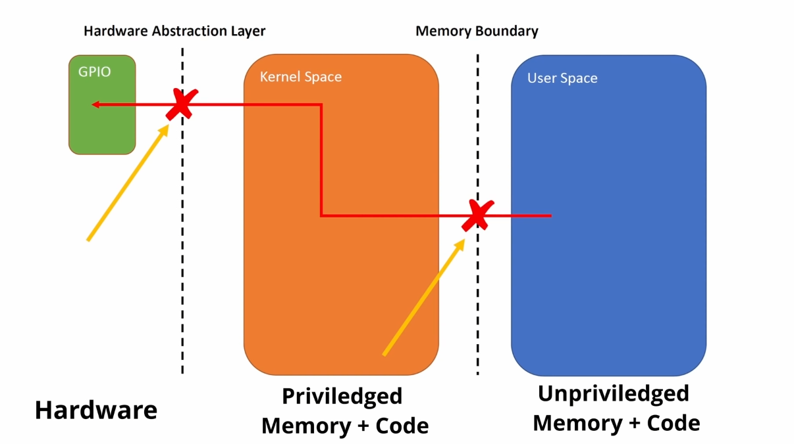

# Custom Device Drivers for Raspberry Pi 

### Why Device Drivers ?

Why are drivers even a thing that we have to worry about when we're doing an embedded development? Let's say we want to access a certain GPIO pin with address ox3f2000 in USER space (through OS) directly, it will not allow us to do that because it is the unprivileged version of the processor so if you write code that goes to access this address ox3f2000, you're going to get a serious set of errors that will crash your program and not do the functionality that you want. 

You're trying to do two things that are illegal when you're talking about embedded development

<p align="center">

</p>

The first is you're trying to cross over a memory boundary in user space you are accessing memory that is being virtually translated from a virtual address to a physical address either in ram or a physical interface on the processor when you access this without asking the kernel for permission essentially or mapping it into your processor that creates your first error your second error is when you try to directly access the gpio bus without talking to the hardware abstraction layer your code may work for your processor but the minute you try to translate that to a new kernel or to a new version of the os or a new chip it's not going to work either.

<p align="center">

</p>

It's the job of these things called drivers to create these they look like tunnels in terms of a diagram but they're really are an interface to legally cross this memory
boundary and to legally cross this driver interface to the hardware abstraction layer.

## Basic Hello World Driver for Host PC

Let's first build a basic device driver for our host PC, then we'll shift to RPI drivers. 
  1.  Write basic hello world driver code in C
  ```
  mkdir drivers
  cd drivers/
  gedit
  ```
  Paste the following code in text editor and save file as hello_world.c in ~/drivers DIR
  ```
  #include <linux/module.h>
  
  static int __init hello_world_init (void)
  {
      pr_info("Hello, World!\n");
      return 0;
  }
  
  static void __exit hello_world_exit (void)
  {
      pr_info("Goodbye, World!\n");
  }
  
  module_init(hello_world_init);
  module_exit(hello_world_exit);
  
  MODULE_LICENSE("GPL");
  MODULE_AUTHOR("EE522 (22100172@lums.edu.pk)");
  MODULE_DESCRIPTION("A simple hello world kernel module");
  ```
  
  Here’s a basic breakdown of this driver:

  line 1: we import the linux module header file, because this is a kernel module ; any calls to userland functions (such as printf) make no sense in the kernel.
  
  lines 4-9: the initialization entry point. We have the static keyword because this function should only be defined and used in this file, and __init because it’s good practice (even though this is a dynamic module so the __init directive will have no effect). We then just print a “hello world” message and return 0, like a classic main “hello world” function would.
  
  lines 12-15: the de-initialization entry point. Similarly, static and __exit are used; the latter is needed since dynamic modules can be unloaded/removed (but again it is good practice to always have these directives). Once more, we print a message using kernel functions.
  
  lines 18-19: assignment of the entry points using kernel macros module_init and module_exit.
  
  lines 21-23: various kernel module info (not really necessary in this case but might as well showcase them).

  2.  Create a file named 'Makefile' (NO FILE EXTENSION) in ~/drivers DIR and paste the following in it.
  
  ```
  obj-m += hello_world.o
  ```
  
  3.  Compile the code. 
  In order to compile our code, we first need to know kernel_modules installed in our system. 
  ```
  uname -r
  ```
  <p align="center">

</p>
  
  ```
  sudo make -C /lib/modules/(your-kernel-version)/build M=$PWD modules
  ```
  <p align="center">

</p>
  
  4.  Try to insert your first driver and check using dmesg. 
  ```
  sudo insmod hello_world.ko
  dmesg
  ```
  <p align="center">

</p>
  
  > __Note__
  > dmesg displays kernel-related messages retrieved from the kernel ring buffer. The ring buffer stores information about hardware, device driver initialization, and messages from kernel modules that take place during system startup. It will print a lot other stuff than your "hello_world!"
  5.  Now remove driver and check dmesg again.
  ```
  sudo rmmod hello_world.ko
  dmesg
  ```
  <p align="center">

</p>
  
  > __Note__ 
  > Why would it print both "hello world!" and "goodbye world!" after you do rmmod ? Because dmesg prints all kernel messages _from startup_

## Basic Hello World Driver for Raspberry Pi 

  1.  Install cross-compile toolchain. 
  ```
  sudo apt install crossbuild-essential-arm64
  ```
  2.  Remake kernel config just in case if its broken
  ```
  export PATH=${HOME}/x-tools/aarch64-rpi4-linux-gnu/bin/:$PATH
  export CROSS_COMPILE=aarch64-rpi4-linux-gnu-
  make ARCH=arm64 CROSS_COMPILE=aarch64-rpi4-linux-gnu- bcm2711_defconfig
  make -j$(nproc) ARCH=arm64 CROSS_COMPILE=aarch64-rpi4-linux-gnu-
  ```
  3.  Compile driver code for RPI 4
  ```
  sudo make ARCH=arm64 CROSS_COMPILE=aarch64-linux-gnu- -C ~/linux M=~/drivers modules
  ```
  <p align="center">

</p>

  4.  Copy 'hello_world.ko' file to /home DIR in RPI RootFS (Change Username to yours in the following command)
  ```
  sudo cp hello_world.ko /media/(username)/root/home
  sync
  ```
  5.  Install driver in RPI using the same commands we used for host PC
  ```
  sudo insmod hello_world.ko
  ```
  6.  And remove driver using the following command
  ```
  sudo rmmod hello_world.ko
  ```
  
There you have it, your first basic device driver for Raspberry Pi 4 ✌

## Advanced Device Drivers

Let's now have a look on how we can build device drivers for hardware devices like a single LED.

### IOCTL based LED driver

1.  Create a new C file and paste the following code in it
```
#include <linux/kernel.h>
#include <linux/init.h>
#include <linux/module.h>
#include <linux/kdev_t.h>
#include <linux/fs.h>
#include <linux/cdev.h>
#include <linux/device.h>
#include<linux/slab.h>                 
#include<linux/uaccess.h>           
#include <linux/ioctl.h>
#include <linux/miscdevice.h>
#include <linux/gpio.h>

#define DEVICE_NAME "led"
int32_t value = 0;

static long     etx_ioctl(struct file *file, unsigned int cmd, unsigned long arg);

static struct file_operations fops =
{
        .owner          = THIS_MODULE,
        .unlocked_ioctl = etx_ioctl,
};

static struct miscdevice misc = {
	.minor 	= MISC_DYNAMIC_MINOR,
	.name 	= DEVICE_NAME,
	.fops 	= &fops,
};

static long etx_ioctl(struct file *file, unsigned int cmd, unsigned long arg)
{
         switch(cmd) {
                case 0:
                        if( copy_from_user(&value ,(int32_t*) arg, sizeof(value)) )
                        {
                                pr_err("Data Write : Err!\n");
                        }
                        gpio_set_value(21,value);
                        pr_info("Value = %d\n", value);
                        break;
                case 1:
                        break;
                default:
                        pr_info("Default\n");
                        break;
        }
        return 0;
}
 
static int __init etx_driver_init(void)
{
	int ret;{
	if(gpio_is_valid(21) == false){
    		pr_err("GPIO %d is not valid\n", 21);
  	}
  
  	if(gpio_request(21,"GPIO_21") < 0){
    		pr_err("ERROR: GPIO %d request\n", 21);
  	}
  
  	gpio_direction_output(21, 1);}
        ret = misc_register(&misc);
        pr_info("Device Driver Insert...Done!!!\n");
        return ret;
}

static void __exit etx_driver_exit(void)
{
        misc_deregister(&misc);
        pr_info("Device Driver Remove...Done!!!\n");
}
 
module_init(etx_driver_init);
module_exit(etx_driver_exit);
 
MODULE_LICENSE("GPL");
MODULE_AUTHOR("EE522");
MODULE_DESCRIPTION("Simple Linux device driver (IOCTL)");
```
2.  Make changes in makefile accordingly and Build driver
```
sudo make ARCH=arm64 CROSS_COMPILE=aarch64-linux-gnu- -C ~/linux M=~/drivers modules
```
3.  Copy 'led.ko' file to /home DIR in RPI RootFS (Change Username to yours in the following command)
```
sudo cp led.ko /media/(username)/root/home
sync
```
4.  Install driver in RPI using the same commands we used for host PC
```
sudo insmod led.ko
```
5.  We need to control the driver through a USER application. For this, create a C file and paste the following code
```
#include <stdio.h>
#include <stdlib.h>
#include <string.h>
#include <sys/types.h>
#include <sys/stat.h>
#include <fcntl.h>
#include <unistd.h>
#include<sys/ioctl.h>
  
int main()
{
        int fd;
        int32_t value, number;
 
        printf("\nOpening Driver\n");
        fd = open("/dev/led", O_RDWR);
        if(fd < 0) {
                printf("Cannot open device file...\n");
                return 0;
        }
 
        printf("Enter the Value to send\n");
        scanf("%d",&number);
        printf("Writing Value to Driver\n");
        ioctl(fd, 0, (int32_t*) &number); 
 
        printf("Closing Driver\n");
        close(fd);
}
```
6.  build it using 
```
gcc -o app app.c
```
7.  Transfer the app file to RPI /home DIR as well
8.  Setup LED circuit as follows
 <p align="center">

</p>
  
9.  Run the app file as follows
```
./app
```
10. Based on your input, the LED will turn ON or OFF 


###  LED Matrix Driver

1.  Create a new file named "ledmatrix.c" and paste the following code in it
```
#include <linux/kernel.h>
#include <linux/init.h>
#include <linux/module.h>
#include <linux/kdev_t.h>
#include <linux/fs.h>
#include <linux/cdev.h>
#include <linux/device.h>
#include<linux/slab.h>                 
#include<linux/uaccess.h>           
#include <linux/ioctl.h>
#include <linux/miscdevice.h>
#include <linux/gpio.h>

#define DEVICE_NAME "led"
int32_t value = 0;

static long     etx_ioctl(struct file *file, unsigned int cmd, unsigned long arg);

static struct file_operations fops =
{
        .owner          = THIS_MODULE,
        .unlocked_ioctl = etx_ioctl,
};

static struct miscdevice misc = {
	.minor 	= MISC_DYNAMIC_MINOR,
	.name 	= DEVICE_NAME,
	.fops 	= &fops,
};

static long etx_ioctl(struct file *file, unsigned int cmd, unsigned long arg)
{
               
        switch(cmd) {
                case 0:
                        if( copy_from_user(&value ,(int32_t*) arg, sizeof(value)) )
                        {
                                pr_err("Data Write : Err!\n");
                        }
  			gpio_set_value(6,value%2);
         		value = value/2;
         		gpio_set_value(13,value%2);
         		value = value/2;
         		gpio_set_value(19,value%2);
         		value = value/2;
         		gpio_set_value(26,value%2);
         		
         		gpio_set_value(21,0);
         		gpio_set_value(20,0);
         		gpio_set_value(16,0);
                        break;
                case 1:
                        if( copy_from_user(&value ,(int32_t*) arg, sizeof(value)) )
                        {
                                pr_err("Data Write : Err!\n");
                        }
  			gpio_set_value(6,value%2);
         		value = value/2;
         		gpio_set_value(13,value%2);
         		value = value/2;
         		gpio_set_value(19,value%2);
         		value = value/2;
         		gpio_set_value(26,value%2);
         		
         		gpio_set_value(21,1);
         		gpio_set_value(20,0);
         		gpio_set_value(16,0);
                        break;
                case 2:
                        if( copy_from_user(&value ,(int32_t*) arg, sizeof(value)) )
                        {
                                pr_err("Data Write : Err!\n");
                        }
  			gpio_set_value(6,value%2);
         		value = value/2;
         		gpio_set_value(13,value%2);
         		value = value/2;
         		gpio_set_value(19,value%2);
         		value = value/2;
         		gpio_set_value(26,value%2);
         		
         		gpio_set_value(21,0);
         		gpio_set_value(20,1);
         		gpio_set_value(16,0);
                        break;
                case 3:
                        if( copy_from_user(&value ,(int32_t*) arg, sizeof(value)) )
                        {
                                pr_err("Data Write : Err!\n");
                        }
  			gpio_set_value(6,value%2);
         		value = value/2;
         		gpio_set_value(13,value%2);
         		value = value/2;
         		gpio_set_value(19,value%2);
         		value = value/2;
         		gpio_set_value(26,value%2);
         		
         		gpio_set_value(21,1);
         		gpio_set_value(20,1);
         		gpio_set_value(16,0);
                        break;
                case 4:
                        if( copy_from_user(&value ,(int32_t*) arg, sizeof(value)) )
                        {
                                pr_err("Data Write : Err!\n");
                        }
  			gpio_set_value(6,value%2);
         		value = value/2;
         		gpio_set_value(13,value%2);
         		value = value/2;
         		gpio_set_value(19,value%2);
         		value = value/2;
         		gpio_set_value(26,value%2);
         		
         		gpio_set_value(21,0);
         		gpio_set_value(20,0);
         		gpio_set_value(16,1);
                        break;
                case 5:
                        if( copy_from_user(&value ,(int32_t*) arg, sizeof(value)) )
                        {
                                pr_err("Data Write : Err!\n");
                        }
  			gpio_set_value(6,value%2);
         		value = value/2;
         		gpio_set_value(13,value%2);
         		value = value/2;
         		gpio_set_value(19,value%2);
         		value = value/2;
         		gpio_set_value(26,value%2);
         		
         		gpio_set_value(21,1);
         		gpio_set_value(20,0);
         		gpio_set_value(16,1);
                        break;
                case 6:
                        if( copy_from_user(&value ,(int32_t*) arg, sizeof(value)) )
                        {
                                pr_err("Data Write : Err!\n");
                        }
  			gpio_set_value(6,value%2);
         		value = value/2;
         		gpio_set_value(13,value%2);
         		value = value/2;
         		gpio_set_value(19,value%2);
         		value = value/2;
         		gpio_set_value(26,value%2);
         		
         		gpio_set_value(21,0);
         		gpio_set_value(20,1);
         		gpio_set_value(16,1);
                        break;
                case 7:
                        if( copy_from_user(&value ,(int32_t*) arg, sizeof(value)) )
                        {
                                pr_err("Data Write : Err!\n");
                        }
  			gpio_set_value(6,value%2);
         		value = value/2;
         		gpio_set_value(13,value%2);
         		value = value/2;
         		gpio_set_value(19,value%2);
         		value = value/2;
         		gpio_set_value(26,value%2);
         		
         		gpio_set_value(21,1);
         		gpio_set_value(20,1);
         		gpio_set_value(16,1);
                        break;
                
                default:
                        if( copy_from_user(&value ,(int32_t*) arg, sizeof(value)) )
                        {
                                pr_err("Data Write : Err!\n");
                        }
  			gpio_set_value(6,value%2);
         		value = value/2;
         		gpio_set_value(13,value%2);
         		value = value/2;
         		gpio_set_value(19,value%2);
         		value = value/2;
         		gpio_set_value(26,value%2);
         		
         		gpio_set_value(21,0);
         		gpio_set_value(20,1);
         		gpio_set_value(16,0);
                        break;
        }
        return 0;
}
 
static int __init etx_driver_init(void)
{
	int ret;
	//gpio reqs
	{
	if(gpio_is_valid(26) == false)
    		pr_err("GPIO %d is not valid\n", 26);
  	
  	if(gpio_request(26,"GPIO_26") < 0)
    		pr_err("ERROR: GPIO %d request\n", 26);

	if(gpio_is_valid(19) == false)
    		pr_err("GPIO %d is not valid\n", 19);
  	
  	if(gpio_request(19,"GPIO_19") < 0)
    		pr_err("ERROR: GPIO %d request\n", 19);
    		
	if(gpio_is_valid(13) == false)
    		pr_err("GPIO %d is not valid\n", 13);
  	
  	if(gpio_request(13,"GPIO_13") < 0)
    		pr_err("ERROR: GPIO %d request\n", 13);
    		
	if(gpio_is_valid(6) == false)
    		pr_err("GPIO %d is not valid\n", 6);
  	
  	if(gpio_request(6,"GPIO_6") < 0)
    		pr_err("ERROR: GPIO %d request\n", 6);
    		
	if(gpio_is_valid(16) == false)
    		pr_err("GPIO %d is not valid\n", 16);
  	
  	if(gpio_request(16,"GPIO_16") < 0)
    		pr_err("ERROR: GPIO %d request\n", 16);
    		
	if(gpio_is_valid(20) == false)
    		pr_err("GPIO %d is not valid\n", 20);
  	
  	if(gpio_request(20,"GPIO_20") < 0)
    		pr_err("ERROR: GPIO %d request\n", 20);
    		
	if(gpio_is_valid(21) == false)
    		pr_err("GPIO %d is not valid\n", 21);
  	
  	if(gpio_request(21,"GPIO_21") < 0)
    		pr_err("ERROR: GPIO %d request\n", 21);

  	
  	//gpio initilizations
  	gpio_direction_output(26, 0);
  	gpio_direction_output(19, 0);
  	gpio_direction_output(13, 0);
  	gpio_direction_output(6, 0);
  	gpio_direction_output(16, 0);
  	gpio_direction_output(20, 0);
  	gpio_direction_output(21, 0);
  	}
        ret = misc_register(&misc);
        pr_info("Device Driver Insert...Done!!!\n");
        return ret;
}

static void __exit etx_driver_exit(void)
{
        misc_deregister(&misc);
        pr_info("Device Driver Remove...Done!!!\n");
}
 
module_init(etx_driver_init);
module_exit(etx_driver_exit);
 
MODULE_LICENSE("GPL");
MODULE_AUTHOR("EE522");
MODULE_DESCRIPTION("LED matrix driver (IOCTL)");
```
2.  Create a new file named "matrix_app.c" and paste the following code in it
```
#include <stdio.h>
#include <stdlib.h>
#include <string.h>
#include <sys/types.h>
#include <sys/stat.h>
#include <fcntl.h>
#include <unistd.h>
#include<sys/ioctl.h>
 
int main()
{
        int fd;
        int32_t value, number;
	unsigned int col;
 
        printf("\nOpening Driver\n");
        fd = open("/dev/ledmatrix", O_RDWR);
        if(fd < 0) {
                printf("Cannot open device file...\n");
                return 0;
        }
 
      printf("Enter row\n");
      scanf("%d",&value);
      printf("Enter Col\n");
      scanf("%d",&col);
        
      ioctl(fd, col, (int32_t*) &value); 

        printf("Closing Driver\n");
        close(fd);
}

```
3.  Make changes in makefile accordingly and Build driver
```
sudo make ARCH=arm64 CROSS_COMPILE=aarch64-linux-gnu- -C ~/linux M=~/drivers modules
```
4.  Copy 'ledmatrix.ko' file to /home DIR in RPI RootFS (Change Username to yours in the following command)
```
sudo cp ledmatrix.ko /media/(username)/root/home
sync
```
5.  Install driver in RPI using the same commands we used for host PC
```
sudo insmod ledmatrix.ko
```
6.  Build the matrix_app.c using 
```
gcc -o matrix_app matrix_app.c
```
7.  Transfer the app file to RPI /home DIR as well
8.  Setup LED circuit as follows
 <p align="center">

</p>
  
9.  Run the matrix_app file as follows
```
./matrix_app
```
10. Based on your input, the corresponding LED will turn ON on LED matrix
