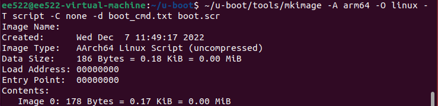

Our First step is to custom configure and build bootloader, kernel and Root File System (RootFS) for RPI 

## Installing VMware and Ubuntu Desktop
Virtual Machines are better than dual boot system when you have to switch between windows and linux machines
  1.  Most updated VMware setup is available [here](https://www.vmware.com/latam/products/workstation-player/workstation-player-evaluation.html) and Ubuntu 22.04.1 LTS can be downloaded from [here](https://ubuntu.com/download/desktop).
  2.  Installing VMware is pretty straight forward, just make sure to select 'non-commercial use only' when prompted.
  3.  Once installed, create new vitual machine and browse Installer Disc Image (the one you just downloaded). 
  4.  Personalize your linux, set disk size, 50-70 GB is required but 100.0 GB is recommended and make sure to select "Store virtual Disk as single file" as it improves some performance. 
  5.  In hardware customization, set RAM and CPU cores half of your system's RAM and CPU cores respectively and proceed installation. 
  6.  After selecting your desired language, select 'install 3rd party softwares...' and 'Erase disk and install Ubuntu' on next slide.
  7.  Finish installation by following on-screen instructions.
## Preparing Micro SD card
After connecting you Micro SD card to your VM, format previous partitions (if any) and create new ones as described below
  1.  Check name of your SD card in terminal.
  ```
  dmesg
  ```
  For me its sdb2 as shown below (64 GB Micro SD card)
<p align="center">

</p>

  2.  Delete Existing Partitions (if any)
  ```
  sudo fdisk /dev/sdb
  ```
  Use command 'd' for deleting partitions and 'w' for altering partition table once you've deleted all exisiting partitions.
  <p align="center">

</p>

  3.  Create New Partitions
  ```
  sudo fdisk /dev/sdb
  ```
  Use command 'n' for new partition. Use command ‘p’ for primary partition. Keep pressing enter until it asks for partition size. For boot partition, anything above 50 MB would work, I’m going for 256 MB. 
  <p align="center">

</p>

  Once created, repeat the process but this time leave the size option empty. This will allot the remaining space for rootfs. 
  <p align="center">

</p>

  Enter ‘t’ to change type for partition 1 with hex code ‘b’. 
  <p align="center">

</p>

  Use command 'p' to verify the partitions and ‘w’ to save alterations.
  <p align="center">

</p>

  4.  Format as FAT32 and ext4 filesystem for boot and root partition respectively.
  ```
  sudo mkfs.vfat -F 32 -n boot /dev/sdb1
  ```
  <p align="center">

</p>

  ```
  sudo mkfs.ext4 -L root /dev/sdb2
  ```
  <p align="center">

</p>

## Custom Boot-Loader

Bootloader is the first piece of firmware which gets executed once the Embedded System is turned-on or reset. The primary objective of the Bootloader is to initialise the Embedded System and provide control to the Application/RTOS. The other objective of the Bootloader might be to support the data loading feature.

  1.  Install basic dependencies. Keep in mind there might be some dependencies which are not mentioned here at the time of verification of this github repo but might be needed when in future. You can install them easily using same method.
  ```
  sudo apt-get update
  sudo apt-get upgrade
  sudo apt-get install make crossbuild-essential-arm64 automake bison chrpath flex g++ git gperf gawk help2man libexpat1-dev libncurses5-dev libsdl1.2-dev libtool libtool-bin libtool-doc python2.7-dev texinfo debootstrap binfmt-support qemu-user-static python-is-python3 python3-dev libssl-dev subversion
  ```

  2.  Git Clone u-boot boot-loader in $HOME DIR
  ```
  git clone git://git.denx.de/u-boot.git
  cd u-boot
  ```
  3.  Configure and make u-boot
  ```
  export CROSS_COMPILE=aarch64-linux-gnu-
  make rpi_4_defconfig
  make
  ```
  4.  Install u-boot in the boot partition 
  > __Note__ 
  > Change your username in following commands
  ```
  sudo cp u-boot.bin /media/(username)/boot/
  svn checkout https://github.com/raspberrypi/firmware/trunk/boot
  sudo cp boot/{bootcode.bin,start4.elf} /media/(username)/boot/
  cat << EOF > config.txt
  enable_uart=1
  arm_64bit=1
  kernel=u-boot.bin
  EOF
  ```
  <p align="center">
  
  </p>
  
  ```
  sudo cp config.txt /media/(username)/boot/
```
  5.  Create Boot Script 
  ```
  cat << EOF > boot_cmd.txt
  fatload mmc 0:1 \${kernel_addr_r} Image
  setenv bootargs "console=serial0,115200 console=tty1 root=/dev/mmcblk0p2 rw rootwait quiet splash init=/sbin/init"
  booti \${kernel_addr_r} - \${fdt_addr}
  EOF
  ```
  <p align="center">
  
  </p>
  
  ```
	~/u-boot/tools/mkimage -A arm64 -O linux -T script -C none -d boot_cmd.txt boot.scr
  ```
  <p align="center">
  
  </p>
  
  ```
 	sudo cp boot.scr /media/(username)/boot/
  ```
  
  ## Kernel (rpi-5.19.y)
  
  The Linux kernel is the main component of a Linux operating system (OS) and is the core interface between a computer's hardware and its processes. It communicates between the 2, managing resources as efficiently as possible.
  
  1.  Download kernel rpi-5.19.y in $HOME DIR
  ```
  git clone --depth=1 -b rpi-5.19.y https://github.com/raspberrypi/linux.git
  cd linux
  ```
  2.  Configure and build kernel
  ```
  make ARCH=arm64 CROSS_COMPILE=aarch64-linux-gnu- bcm2711_defconfig
  make -j$(nproc) ARCH=arm64 CROSS_COMPILE=aarch64-linux-gnu-
  ```
  3.  Install kernel and Device Tree Blob (DTB) in the boot partition
  ```
  sudo cp arch/arm64/boot/Image /media/(username)/boot/
  sudo cp arch/arm64/boot/dts/broadcom/bcm2711-rpi-4-b.dtb /media/(username)/boot/
  ```
  
  ## Root File System (RootFS: Stretch-Debian 9)
  
  The root file system is the top of the hierarchical file tree. It contains the files and directories critical for system operation, including the device directory and programs for booting the system.
  
  1.  Build First Stage of Debian rootfs in $HOME DIR
  ```
  mkdir rootfs
  sudo debootstrap --arch=arm64 --foreign stretch rootfs
  ```
  2.  Copy qemu (open-source emulator already installed in dependencies) and resolv.conf from host PC to guest
  ```
  sudo cp -av /usr/bin/qemu-aarch64-static ~/rootfs/usr/bin
  sudo cp -av /run/systemd/resolve/stub-resolv.conf ~/rootfs/etc/resolv.conf
  ```
  3.  Install Kernel Modules and VmLinuz in rootfs
  ```
  cd linux
  sudo make ARCH=arm64 modules_install INSTALL_MOD_PATH=~/rootfs
  ```
  > __Note__
  > Before next command, change INSTALL_PATH in makefile in ~/linux DIR to /home/(username)/rootfs/boot/ 
  > <p align="center">
  > 
  > </p>
  
  ```
  sudo make install ARCH=arm64
  ```
  4.  Chroot in rootfs and setup Debian 9 (second stage, basic libraries/plugins, users, fstab etc)
  ```
  sudo chroot rootfs
  export LANG=C
  /debootstrap/debootstrap --second-stage
  ```
  ```
  nano /etc/apt/sources.list
  ```
  This command will open a file with some text written already. Replace this text with the following
  
  ```
  deb http://deb.debian.org/debian/ stretch main contrib non-free
  deb http://deb.debian.org/debian-security/ stretch/updates main contrib non-free
  deb http://deb.debian.org/debian/ stretch-updates main contrib non-free
  deb http://ftp.debian.org/debian stretch-backports main
  ```
  
  ```
  apt-get update
  apt-get install sudo ifupdown net-tools ethtool udev wireless-tools iputils-ping resolvconf wget apt-utils wpasupplicant network-manager dialog perl locales 
  apt-get upgrade
  echo RaspberryPi > /etc/hostname
  echo 127.0.0.1 localhost > /etc/hosts
  echo 127.0.1.1 RaspberryPi >> /etc/hosts
  passwd root
  locale-gen "en_US.UTF-8" 
  ```
  ```
  nano /etc/fstab 
  ```
  Add the following text in this file
  > __Note__
  > The following command has Tabs and NOT Spaces!
  
  ```
  /dev/mmcblk0p2	/	ext4	defaults,noatime	0	1 
  ```

  Copy rootfs in you SD Card's Root DIR, plug-in in RPI, and login to use you fully custom built LFS ✌
  
