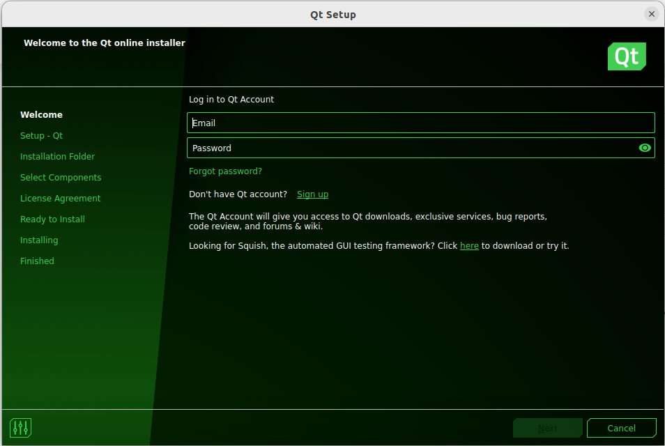

##  QT embedded application development

1.  Install dependencies
```
sudo apt-get update
sudo apt-get install libxcb-xinerama0
```
2.  Download QT Unified Installer for installing QT for host PC (desktop) 
```
cd ~
mkdir qt-development
cd qt-development
wget https://download.qt.io/official_releases/online_installers/qt-unified-linux-x64-online.run
```
3.  Install QT Unified Installer
```
sudo chmod +x qt-unified-linux-x64-online.run
./qt-unified-linux-x64-online.run
```
If all went well, you will see a promt like this
<p align="center">

</p>

It will ask you for an account, I already have one (non-commercial one, its completely free). If you don't have one, you can create by clicking on sign up.
4.  Select latest QT LTS version, for me its 6.4.1 as 6.5.0 is beta version. Along with this, we also need QT designer and development tools.
  <p align="center">

</p>

5.  Install QT Creator 
```
sudo apt-get install qtcreator
```
6.  
