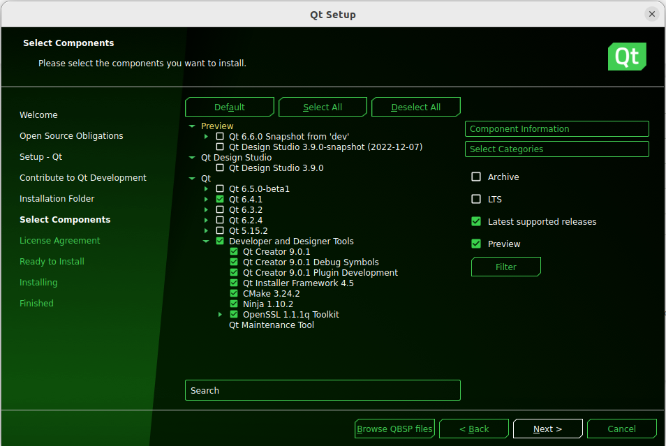

##  QT embedded application development

1.  Install dependencies
```
sudo apt-get update
sudo apt-get install libxcb-xinerama0
```
2.  Download QT Unified Installer for installing QT for host PC (desktop) 
```
cd ~
mkdir qt-development
cd qt-development
wget https://download.qt.io/official_releases/online_installers/qt-unified-linux-x64-online.run
```
3.  Install QT Unified Installer
```
sudo chmod +x qt-unified-linux-x64-online.run
./qt-unified-linux-x64-online.run
```
If all went well, you will see a promt like this
<p align="center">

</p>

It will ask you for an account, I already have one (non-commercial one, its completely free). If you don't have one, you can create by clicking on sign up.
4.  Select latest QT LTS version, for me its 6.4.1 as 6.5.0 is beta version. Along with this, we also need QT designer and development tools.
  <p align="center">

</p>

5.  Install QT Creator 
```
sudo apt-get install qtcreator
```
6.  Build QT for remote device
```
cd ~/qt-development
wget https://download.qt.io/official_releases/qt/5.15/5.15.0/single/qt-everywhere-src-5.15.0.tar.xz
tar xvf qt-everywhere-src-5.15.0.tar.xz
```
Create new file using gedit in same DIR under name "build-all" and paste the following 
```
#/bin/bash

cd qt-everywhere-src-5.15.0
echo yes | ./configure -opensource -xplatform linux-aarch64-gnu-g++ -no-opengl

gmake && gmake install
```
Before we run "build-all" we need to make some changes in qt-5.15.0 source files. I have provided the changes in form of 2-line pairs down below. first line to be pasted in terminal while second line is to be added in file which previous command will open in text editor. (These are include lines so will be added where rest of the include lines are written)
```
gedit qt-everywhere-src-5.15.0/qtbase/src/corelib/global/qfloat16.h 
#include <limits>

gedit qt-everywhere-src-5.15.0/qtbase/src/corelib/text/qbytearraymatcher.h 
#include <limits>
```
Now run the file using
```
./build-all
```
After this the QT 5.15.0 will be built and installed in /usr/local and can be used in QTcreator
