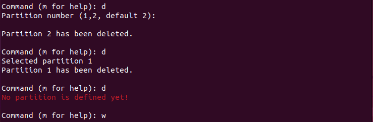
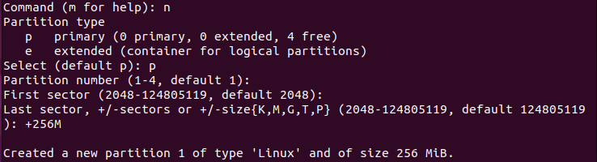
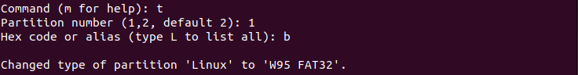
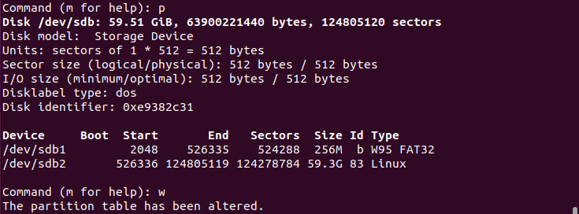

# Linux From Scratch (LFS) for Raspberry Pi 
This repo aims to provide a step-by-step guide in order to build your own custom linux system on Raspberry Pi, completely from scratch. 
<p align="center">

</p>

#### Why LFS ? 
  1.  Learn how a Linux System works internally
  2.  Building very compact Linux Systems. There are LFS enthusiasts out there who were able to install a system that was just enough to run the Apache web server, total disk space usage was approximately 8 MB. With further stripping, that can be brought down to 5 MB or less. Try that with a regular distribution 👀.
  3.  LFS is extremely flexible. You can literally skip so many plug-ins which you really do not need but they come with regular distribution by default. 
## Prerequisites
In order to build LFS, following are the prerequisites you need:
  1.  Desktop Linux machine (Ubuntu 22.04.1 LTS in my case)
  2.  Micro SD Card and Card Reader (I'm currently using 32 GB SD card)
  3.  Raspberry Pi 4 (This tutorial will guide you to build a 64-bit Debian dist on RPI 4 but the same applies for RPI 3B)
  Rest of the stuff is required after we prepare our SD card
  4.  LAN cable
  5.  USB-to-C/USB-to-B cable for RPI 4/RPI 3B respectively
  6.  Micro HDMI-to-HDMI/HDMI-to-HDMI cable for RPI 4/RPI 3B respectively
  7.  Monitor with HDMI support and Keyboard 
## Installing VMware and Ubuntu Desktop
Virtual Machines are better than dual boot system when you have to switch between windows and linux machines
  1.  Most updated VMware setup is available [here](https://www.vmware.com/latam/products/workstation-player/workstation-player-evaluation.html) and Ubuntu 22.04.1 LTS can be downloaded from [here](https://ubuntu.com/download/desktop).
  2.  Installing VMware is pretty straight forward, just make sure to select 'non-commercial use only' when prompted.
  3.  Once installed, create new vitual machine and browse Installer Disc Image (the one you just downloaded). 
  4.  Personalize your linux, set disk size, 50-70 GB is required but 100.0 GB is recommended and make sure to select "Store virtual Disk as single file" as it improves some performance. 
  5.  In hardware customization, set RAM and CPU cores half of your system's RAM and CPU cores respectively and proceed installation. 
  6.  After selecting your desired language, select 'install 3rd party softwares...' and 'Erase disk and install Ubuntu' on next slide.
  7.  Finish installation by following on-screen instructions.
## Preparing Micro SD card
After connecting you Micro SD card to your VM, format previous partitions (if any) and create new ones as described below
  1.  Check name of your SD card in terminal.
  ```
  dmesg
  ```
  For me its sdb2 as shown below (64 GB Micro SD card)
<p align="center">

</p>

  2.  Delete Existing Partitions (if any)
  ```
  sudo fdisk /dev/sdb
  ```
  Use command 'd' for deleting partitions and 'w' for altering partition table once you've deleted all exisiting partitions.
  <p align="center">

</p>

  3.  Create New Partitions
  ```
  sudo fdisk /dev/sdb
  ```
  Use command 'n' for new partition. Use command ‘p’ for primary partition. Keep pressing enter until it asks for partition size. For boot partition, anything above 50 MB would work, I’m going for 256 MB. 
  <p align="center">

</p>

  Once created, repeat the process but this time leave the size option empty. This will allot the remaining space for rootfs. 
  <p align="center">

</p>

  Enter ‘t’ to change type for partition 1 with hex code ‘b’. 
  <p align="center">

</p>

  Use command 'p' to verify the partitions and ‘w’ to save alterations.
  <p align="center">

</p>

  4.  Format as FAT32 and ext4 filesystem for boot and root partition respectively.
  ```
  sudo mkfs.vfat -F 32 -n boot /dev/sdb1
  ```
  <p align="center">

</p>

  ```
  sudo mkfs.ext4 -L root /dev/sdb2
  ```
  <p align="center">

</p>

## Building Cross-Compiler Toolchain (CROSSTOOL-NG)
  1.  Install basic dependencies. Keep in mind there might be some dependencies which are not mentioned here at the time of verification of this github repo but might be needed when in future. You can install them easily using same method.
  ```
  sudo apt-get update
  sudo apt-get upgrade
  sudo apt-get install make automake bison chrpath flex g++ git gperf gawk help2man libexpat1-dev libncurses5-dev libsdl1.2-dev libtool libtool-bin libtool-doc python2.7-dev texinfo debootstrap binfmt-support qemu-user-static
  ```
  2.  Download Crosstool-NG
  ```
  git clone https://github.com/crosstool-ng/crosstool-ng
  cd crosstool-ng/
  git checkout crosstool-ng-1.25.0 -b 1.25.0
  ```
<p align="center">

</p>

  3.  Build and install toolchain
  ```
  ./bootstrap
  ./configure --prefix=${PWD}
  make
  make install
  export PATH="${PWD}/bin:${PATH}"
  ```
  4.  Configure toolchain  for the target device (Raspberry Pi 4)
  ```
  ct-ng show-aarch64-rpi4-linux-gnu
  ```
  <p align="center">

</p>

  ```
  ct-ng aarch64-rpi4-linux-gnu
  ```
 <p align="center">

</p>

  5.  Build toolchain. (The built toolchain will be stored in ~/x-tools/aarch64-rpi4-linux-gnu)
  ```
  ct-ng build
  ```
  6.  For some users, there might be some 'retrieving tarball errors' ('zlib-1.2.12' for me, could be any tarball for you). 
  <p align="center">

</p>

  A simple fix for that is to copy the exact version of required tarball from terminal and search for its tar file on internet (Make sure you download the exact same version). 
  <p align="center">

</p>

  Once downloaded place it in ~/src DIR because crosstool downloads, stores and grabs these tarballs in ~/src DIR, Check the last tarball in Screenshot. (you can make new DIR named 'src' in $HOME) 
  <p align="center">

</p>

  Also, this process might take 35-40 minutes 😅
  
  
  
